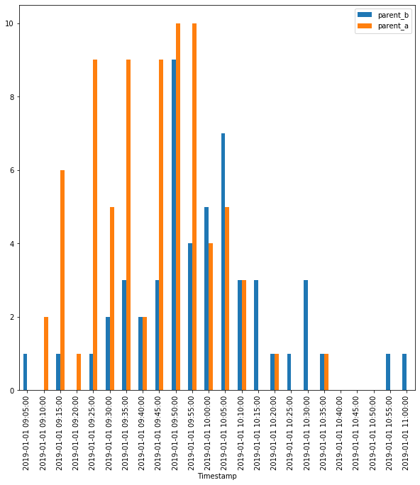

# Bright Horizons check-in times

Analysis of check in times for different parents.

The project consists of two parts:

- Google App script to gather data from Gmail.
- A colab to analyze the data.

## Gmail data gathering

Create a Gmail `label` for the Bright Horizons named `"Bright Horizons check-in"`.

You can start a new Google App script with the following code.

```javascript
function getData() {
  var parentAName = "SPECIFY!";
  var label = GmailApp.getUserLabelByName("Bright Horizons check-in");
  var threads = label.getThreads();
  var data = {};
  data["parent_a"] = [];
  data["parent_b"] = [];
  for (var i = 0; i < threads.length; ++i) {
    var message = threads[i].getMessages()[0];
    var body = message.getBody();
    var sp = body.match(/\d+/g);
    // year, month, day, hours, minutes, seconds, milliseconds
    // [6, 2019, 9, 37]
    var dateObject = new Date(sp[1], 0, sp[0], sp[2], sp[3]);
    if (body.search(parentAName) >= 0) {
      data["parent_a"].push([sp[2], sp[3]]);
    } else {
      data["parent_b"].push([sp[2], sp[3]]);
    }
  }
  // Save data.
  var blob = Utilities.newBlob(JSON.stringify(data));
  blob.setName("email.json");
  blob.setContentTypeFromExtension();
  DriveApp.createFile(blob);
}
```

What we are doing here is getting all email threads under the `label` and processing them by extracting the date and aggregating them per user. Finally, the data structure `data` is saved in JSON format.

The data structure in data is a dictionary that looks like this:

    "parent_a": [["hour", "minute"], ["hour", "minute"], ...],
    "parent_b": [["hour", "minute"], ["hour", "minute"], ...]

## Histogram of check in times

The colab loads the JSON file from your Drive and generates a Pands `DataFrame`.

The histogram is generated by grouping the times as the index of join table for both parents.


